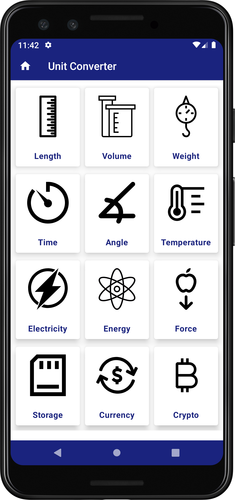
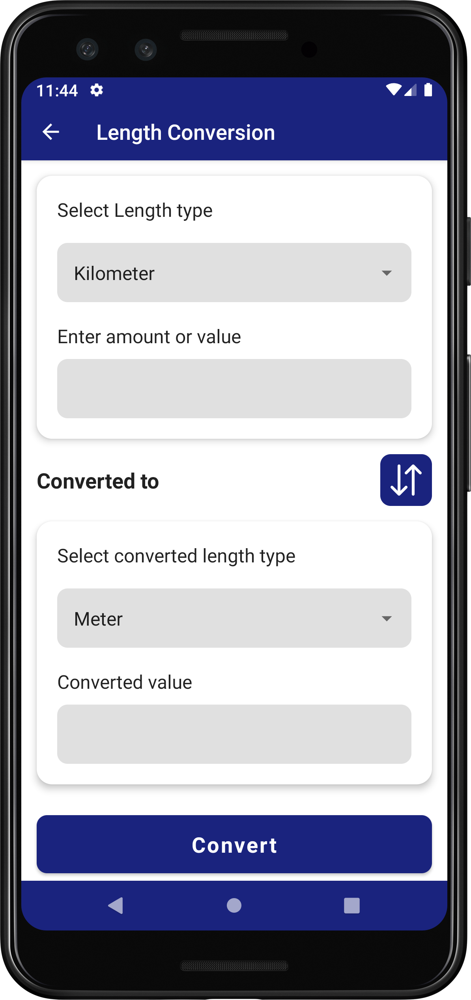

# UnitConverter
Jetpack compose app for converting various measurement units. It consumes Neutrinoapi for unit conversion
- Temperature 
- Length
- Volume
- Weight
- Time
- Angle
- Energy
- Electric Current
- Force
- Currency
- Cryptocurrrency
- Digital Storage

# Screenshots

|<strong>Measurement Units</strong>|<strong>Unit Conversion</strong>|
|:--:|:--:|
|||

# Tools and Libraries used
- Retrofit - Type-safe HTTP Client for consuming RESTful API web services in android
- Gson - Kotlin/Java library for converting Kotlin/Java Objects into their JSON representation
- Navigation Components - Android Jetpack's component for implementing navigation for consistent and predictable user experience in android app
- ViewModel - Responsible for preparing and managing the data for UI
- Coroutines - Kotlin features for executing synchronous and asynchronous task/code in android

# Contributions & Support
- There is a Posibility of it being buggy! Help me fix the issue through pull request.
- Like it! then star ⭐ it!

